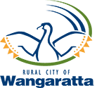
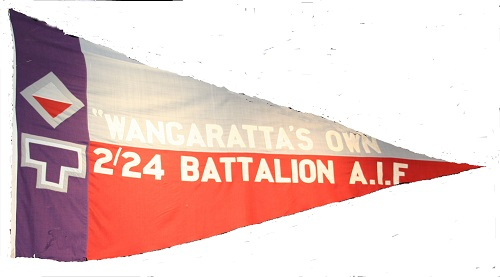

# The 2/24th Australian Infantry Battalion Association Inc.

## Freedom of the City of Wangaratta

The Association was uniquely granted the Freedom of the City by the Rural City of Wangaratta in 1990 - to our knowledge the only Battalion Association in Australia to be granted this honour. We are very proud of this Honour, which is recorded on the original Authority Document displayed in the Wangaratta Council Chambers.

In pursuance of a Resolution adopted unanimously by the Council of the City of Wangaratta on the sixteenth day of July, 1990 be it known to all persons that The Freedom of the City of Wangaratta has been conferred upon &ldquo;Wangaratta&rsquo;s Own&rdquo; 2/24 Australian Infantry Battalion Association

While such a grant carries with it only nominal material privileges it has for many generations been regarded as the highest compliment a Council may offer; and by custom, it has been reserved for outstanding occasions.  Council acknowledges its appreciation of the contribution made by this Unit to community peace and national democracy and congratulates &ldquo;Wangarata&rsquo;s Own&rdquo; 2/24 Australian Infantry Battalion Association on its Fiftieth Anniversary since
formation.

Now therefore the Council hereby directs that the title, honour and distinction shall be conferred upon all ranks of marching freely through the streets of the City of Wangaratta on all ceremonial occasions with drums beating, Bands playing and with Banner flying

Council trust that the Citizens of Wangarata shall at all times ensure that the Grant of Freedom of the City shall be honoured and complied with.

The Common Seal of the Mayor Councillors and Citizens of the City of Wangaratta was hereunto affixed the 27th day of October 1990 in the presence of
Mayor K Gleeson
Councillor V Gleeson
Town Clerk J Elward

# 2/24th Battalion Pennant

The Battalion&rsquo;s Pennant resides at the
Wangaratta Council Chambers. Positioned at the top of the stairs it is
very impressive and emphasises the strong bond between Wangaratta and
the 2/24th Battalion "Wangaratta's Own".

Unfortunately, the pennant was showing signs of wear and tear and
needed to be replaced. The Council has very generously paid for the new
pennant, plus another pennant to be located at Wangaratta High School
and used for their ANZAC Day ceremonies on ANZAC day eve.

We are aware that several people have been responsible for replacing
the Pennants and we thank them all, particularly Cr Roberto Paino and
Cr Don Joyce.

The Association is very grateful for the support from the Council,
Schools and the local community for our efforts to preserve the story
of 2/24th Battalion for the interest of future generations.

