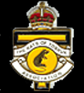

# Upcoming 2/24th Events

  * Anzac Day March - 25 April 2018. Assemble in Flinders Street
  * Anzac Day Reunion Luncheon at Pascoe Vale RSL 25 April 2018
  * Battalion Birthday Lunch, Friday 5 July at Pascoe Vale RSL
  * Annual General Meeting - 10.00 am Friday 23 August 2013 at venue to be advised
  * 2/24 Shrine Pilgrimage, Sunday 21 October, 2018 - tbc
  * 9th Division Shrine Service and Luncheon, Friday 26 October 2018 tbc
  * Annual Wangaratta Reunion 9-11 November, 2018

---

# Links to Associated bodies

## Wangaratta High School

Under the 'Adopt an Ex-Service Association' program, sponsored by the Shrine of Remembrance, Wangaratta High School has adopted the 2/24 Infantry Battalion

## Rats of Tobruk Assoc Inc (Vic)

Visit the Rats of Tobruk website

