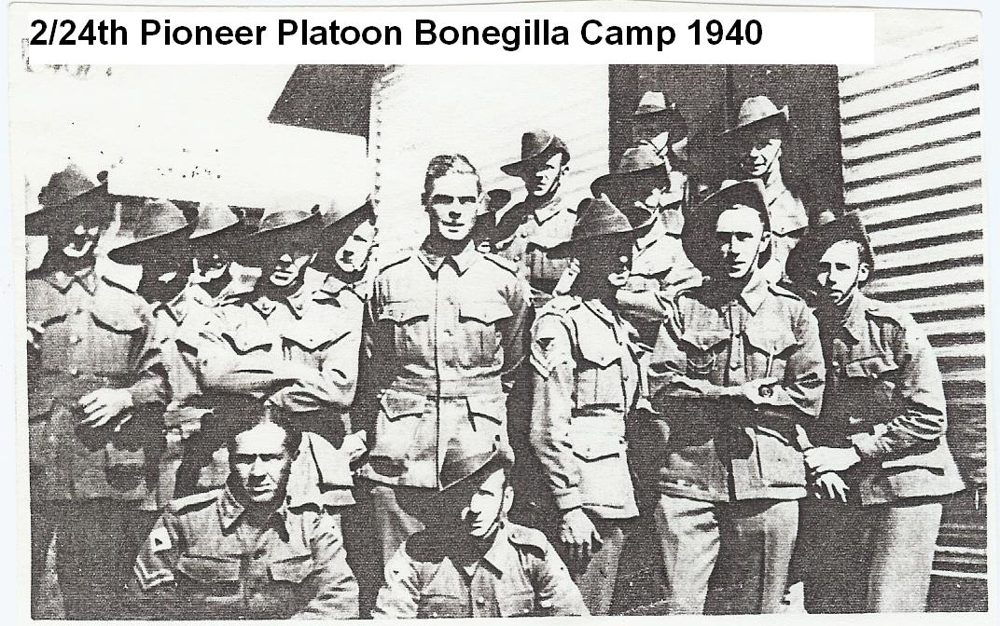
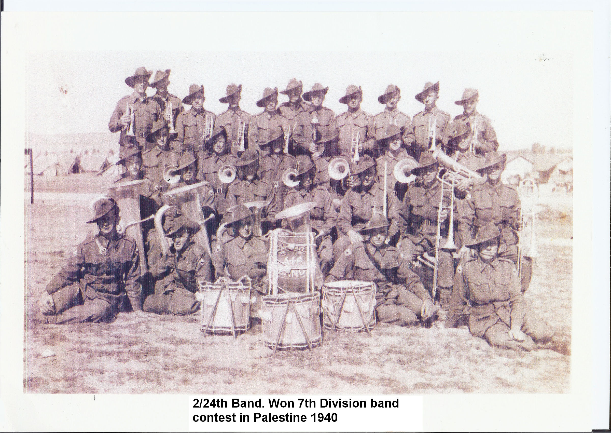
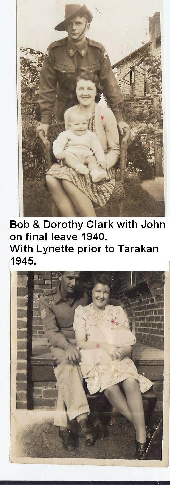
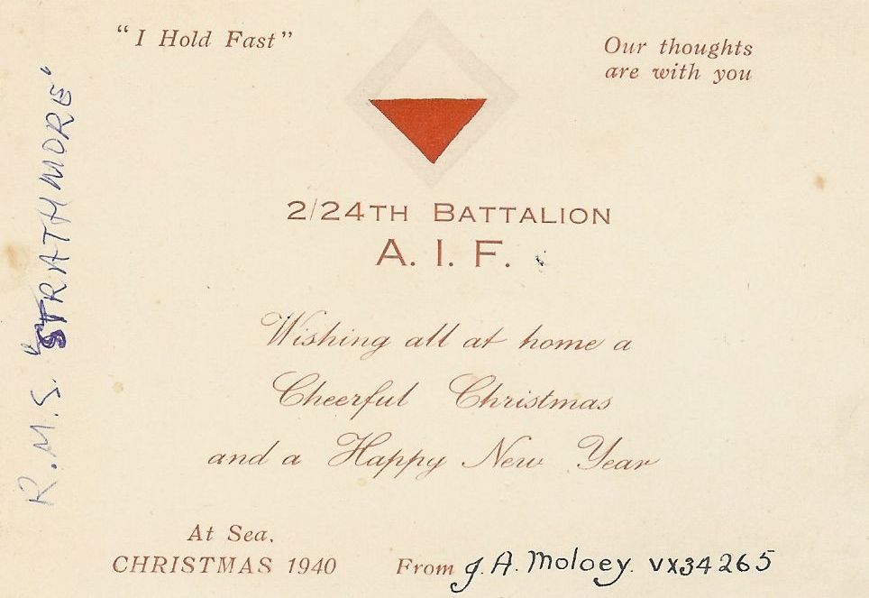
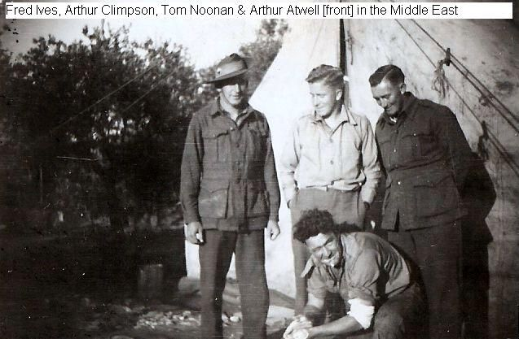
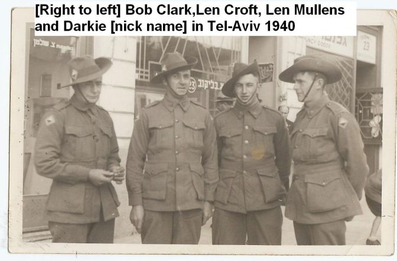

# The Memories of Bob Clark (VX44006) 2008

>I was an original member of the 2/24th Battalion who served in
Tobruk, El Alamein, Syria, New Guinea and Tarakan.

At the age of 88 I still remain a committee member of the 2/24th
Battalion Association Inc.

