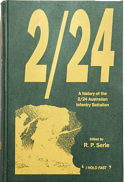
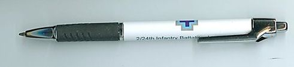
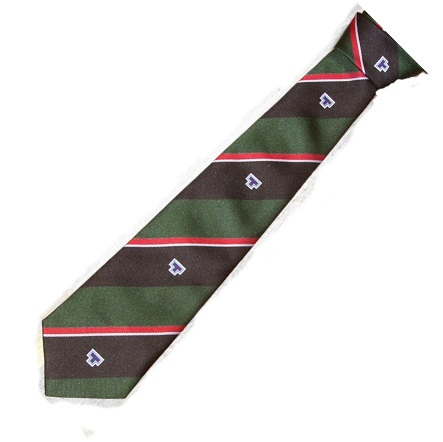
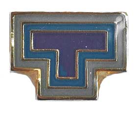

#  2/24th Items for sale

The folowing items may be purchased from the 2/24 Battalion Association. 

## Order and Payment methods
1.	Post a cheque or money order made out to '2/24 Battalion Association' to accompany the order to 
   Treasurer, 2/24th Battalion Assoc., 
   19 Maree Court 
   Rowville, Vic  3178 
2.	Electronic Orders - send an email (with details of order and recipient address) to  
	 orders@2-24.battalion.org.au (post a cheque or complete a bank transfer – see below) 
  By bank transfer to: Account Name - The Australian Infantry Battalion Association, Inc.  
  Commonwealth Bank of Australia: BSB 063 450  Account No. 1001 3626        
   Please include surname and the product you are purchasing in the details box when transferring electronically, and send a         confirmation email to the above email address.

* Prices include postage within Australia.

--
## **Official History of 2/24 Australian Infantry Battalion** -- [out of stock - reprinting]

---
## **Shooting Through - Katrina Kittel** -- $tba 

---
## **Pens with logo of 2/24 Australian Infantry Battalion** -- $20.00 per set of 5

---

## **Battalion Tie** -- $25.00 each (association members only)

For purchase by 2/24 Association members only.

---

## **Lapel Badge** [1.5cm wide] -- $10.00 each (association members only)

For purchase by 2/24 Association members only.

---

# Please note:

  * Ties and Badges are for purchase by 2/24 Association members only.
  * The pens and history of the 2/24 are available for open purchase.
  * *Shooting Through* will be available at Association functions.
 

