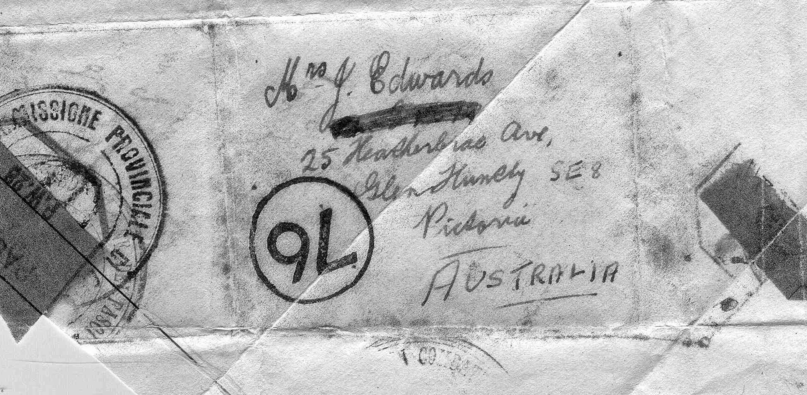
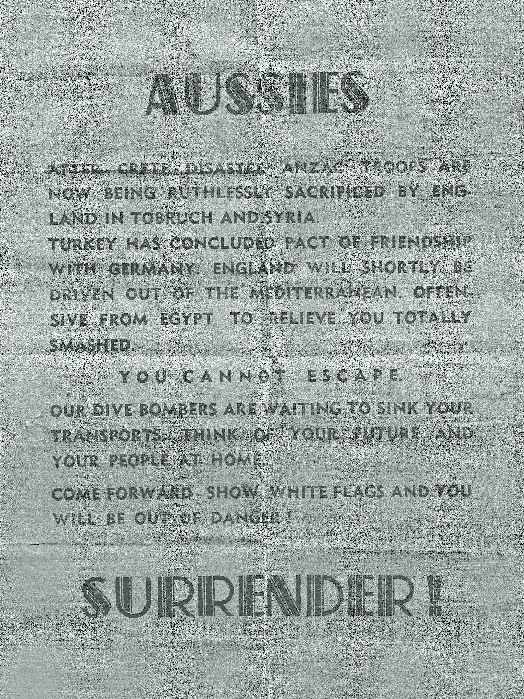

# Stories from 2/24 members

## A note to home

This item is from Eric Edwards VX31279 

I am enclosing an article and brief story you may like to include in the "Furphy Flyer". I was taken prisoner of war at Tobruk on the 1st May 1941, because we had run out of ammunition in that section. Two days later, i.e. on the 3rd May, a German officer invited me and some other POWs standing nearby, to write a letter of not more than 25 words to our relatives, and he promised that they would be dropped by plane over British lines.

This was undoubtedly done for the letter which I wrote at that time was received by my mother. In fact, it was the first real indication she had that I was a POW. She had received notification that I was "missing believed prisoner of war" but not that I was a POW. I wrote on a scrap of paper, about 7 inches by 5 1/4 inches and, as I had no envelope, I folded it over and tucked the peaks in so that the finished article was about 2 3/4 inches by 2 inches in size.

The two dark "patches" represent the brown paper adhesive used by the Censor to seal it so that it would not come undone while in transit.

I wrote:

>  Dear Mum,
>  I have been taken a prisoner of war without wounds at Tobruk. I am in good health.
>  There is no cause for worry. I will write as soon as possible. Advise others.
>  Your loving son, Eric.

## Surrender!!

Mrs Beverley Weir sent this item in. It is a copy of a leaflet dropped on Australian troops at Tobruk. Her uncle was Thomas Ingham, VX30904, KIA.
(Keith Clark tells me they came in very handy as toilet paper!)

